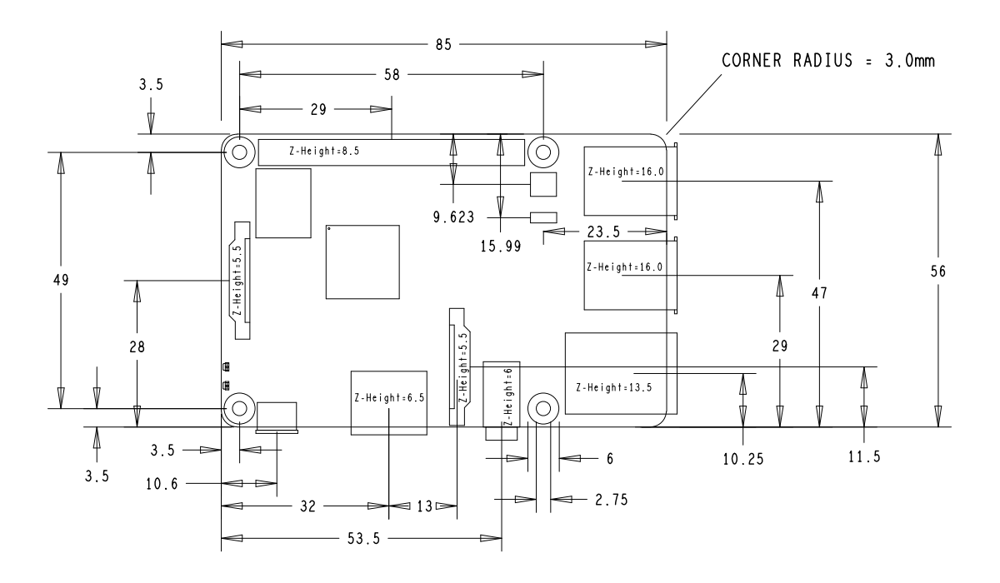
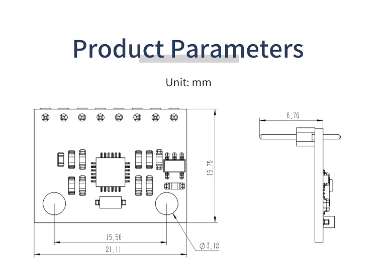
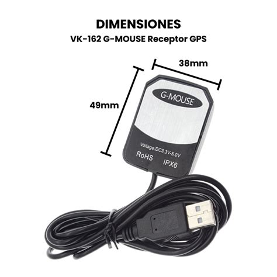
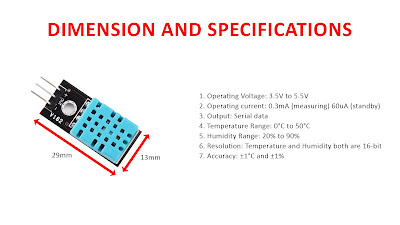
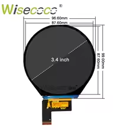

**Relevant Dimensions for 3D model**

For front plate:
    * Width outer: 200 mm
    * height outer: 65 mm
    * width inner: 190 mm
    * height inner: 50 mm
    * thickness top / bottom besel: 7 mm
    * thickness left / right besel: 5 mm

Hole Carplay screen:
    * height: 30 mm
    * width: 20 mm
    * 5 mm from right edge of front plate
    * length is 90 mm
    * 5 mm diameter of screw.
    * 2.5 mm at the end.
    * 30 mm thich along the long side.

Holes switches (5):
    * diameter: 8 mm
    * located above raspberry pi

Raspberry pi:
    * breathing area:
        - height: 20 mm (approx. same as RP3)
        - width: 56 mm
    * Needs M2/M2.5 diameter

                                                                                                                                
MPU6050:
    * M3 fits

VK162G USB:
    * height: 15 mm
    * M3 fits

DHT11:
    * hole size: 3 mm
    * M3 fits

LDR LM393:
    * M3 fits
    * hole size: 3 mm
    * width: 14 mm
    * height: 30 mm (without sensor sticking out).

M3 nut: 5 mm diameter (6 edges).

Screen: 
    * hole size 2.5 mm
    * Needs M2/2.5 bold

Connection to cluster panel:

    * 3 1.75 mm bolds (already present), about 2 mm of thickess needed for connection. 
    * Triangle shaped:
    - bottom distance: 75 mm
    - right to top: 102 mm
    - left to top: 102 mm
    * small support piece:
    - width: 30 mm
    - height: 20 mm

    * 10 mm depth in the cluster panel.
    * best to have connectio side of screen at a 45 degree angle with the cluster panel, so NW oriented.